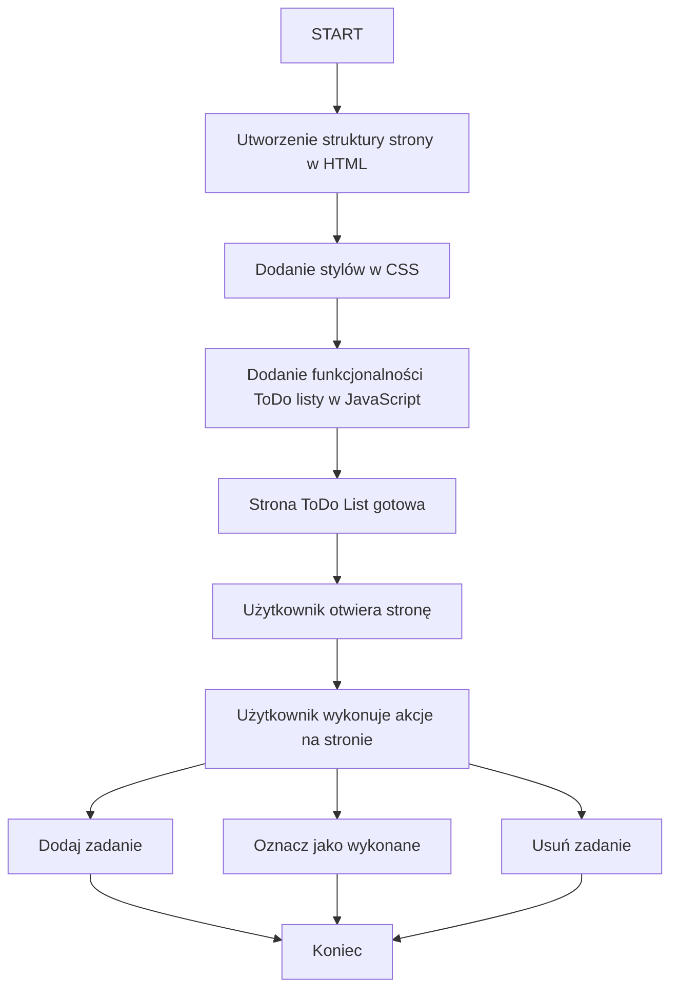

```mermaid
flowchart TD
    A[START] --> B[Utworzenie struktury strony w HTML]
    B --> C[Dodanie stylów w CSS]
    C --> D[Dodanie funkcjonalności ToDo listy w JavaScript]
    D --> E[Strona ToDo List gotowa]
    E --> F[Użytkownik otwiera stronę]
    F --> G[Użytkownik wykonuje akcje na stronie]

    G --> H1[Dodaj zadanie]
    G --> H2[Oznacz jako wykonane]
    G --> H3[Usuń zadanie]

    H1 --> I[Koniec]
    H2 --> I
    H3 --> I
```